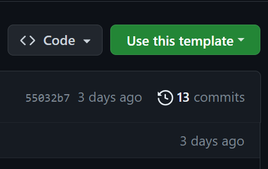
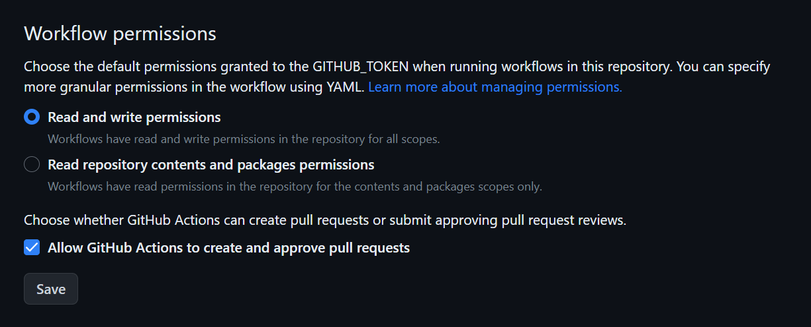

# EcoFriendly Github

Github Workflow setup to keep your contribution graph green.

## Working

The workflow runner fetches a random quote and appends it to the quotes.txt file every 11 hours. The changes to the file is then commited and pushed recording a contribution keeping the graph green.

## Getting started

1. Generate a repository using this repo template.

    

2. After creating your repository, Go to `.github/workflows/node.js.yml` file.
    
3. Replace the `YourUserNameHere` and `YourUserEmailHere` in line 25 and 26 with your github username and email.
4. Make sure you have enabled the read and write permission of workflow setting."Read and write permissions" are enabled in Settings -> Actions -> General -> Workflow permissions.
    
5. Star this repository. Hehe. Follow [shubhansu-kr](https://github.com/shubhansu-kr).

## Update

I have disabled the github actions for this repository to prevent it from populating my github graph. So if you fork this repository, you will notice that `workflows` folder is missing in the `.github` folder, which may cause confusion or discrepancy.

Solution: After forking the repository you can simply create `workflows` folder
in your cloned repository and place the `node.js.yml` inside it.
or
You can just go to this working example: ([Losttrack21/EcoFriendly-GitHub](https://github.com/Losttrack21/EcoFriendly-GitHub)) and generate from template there.

Make sure your wrokflow is enabled. By default when you fork a repository the workflow is disabled by github actions. You will find the workflow in actions tab.
